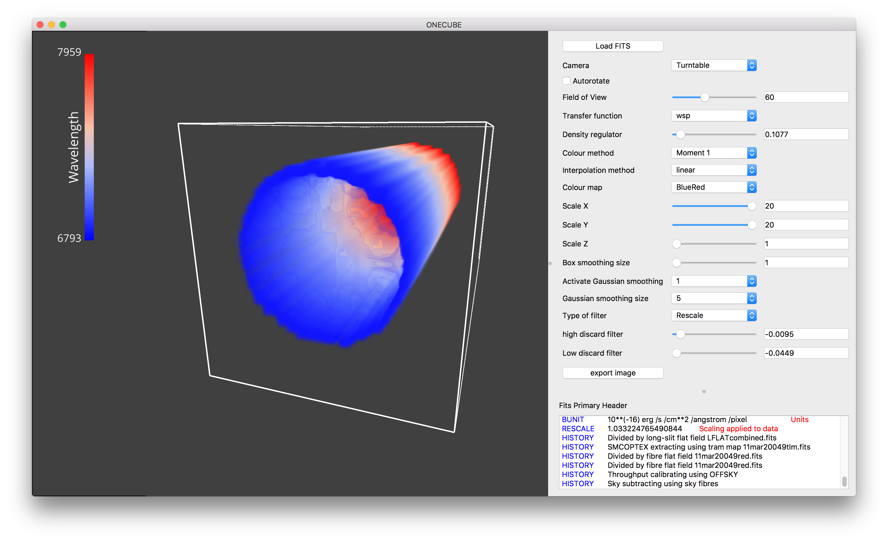

Usage
=====

shwirl's GUI
-------------

Visualisation and colour bar
----------------------------
The 3D volume can be rotated, panned and zoomed using a mouse or a trackpad. To rotate the cube, simply click and move.
Panning can be achieved by click-n-move while pressing the *shift* key. Zooming in and out is achieved using the wheel,
or using trackpad interactions like using two fingers (depending on device).

The colour bar information is based on the FITS header and will vary depending on the colouring method.
If you find any oddities, please let me know.

Widgets
-------
The widgets can be used to interact and modify the visualisation outcome. As it was primarily put together to experiment,
widgets menu has the following look (image below). Future work should make it slightly more appealing!

Usage is straight forward: *click, slide, select*. See what happens!

Widgets include:

   * Camera type (Basic VisPy cameras)
   * Field of view
   * Transfer function

     - Maximum Intensity Projection (MIP)
     - Local Maximum Intensity Projection (LMIP)
     - Weighted Sum Projection (WSP)
     - Iso surface

   * Colour method

     - Moment 0 (maps voxel intensity to colour)
     - Moment 1 (maps velocity to colour and voxel intensity to transparency)
     - RGB cube (maps voxel xyz position to rgb, and voxel intensity to transparency)

   * Interpolation method
   * Scale axes (stretch)
   * Smoothing filters

     - Box smoothing
     - Gaussian smoothing

   * Filter

     - Intensity clipping (Filter out)
     - Intensity domain scaling (Rescale)

Axis labels
-----------
Axis labels are currently under development. Coming soon.